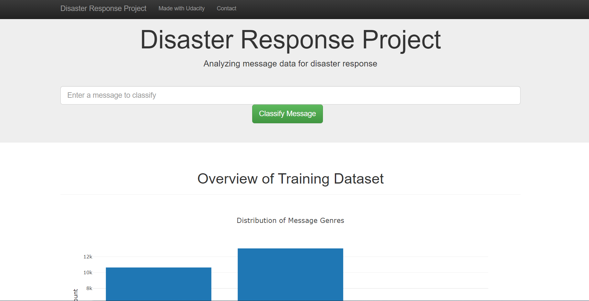
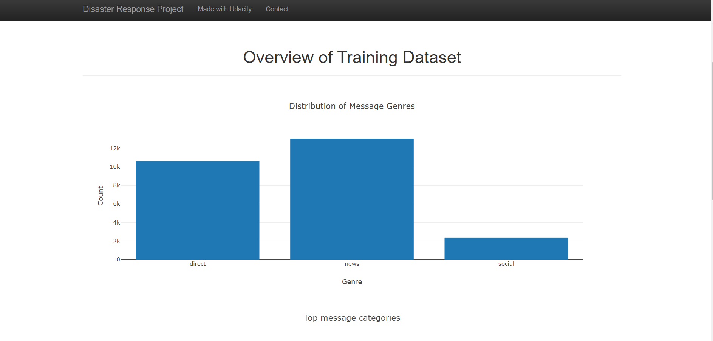
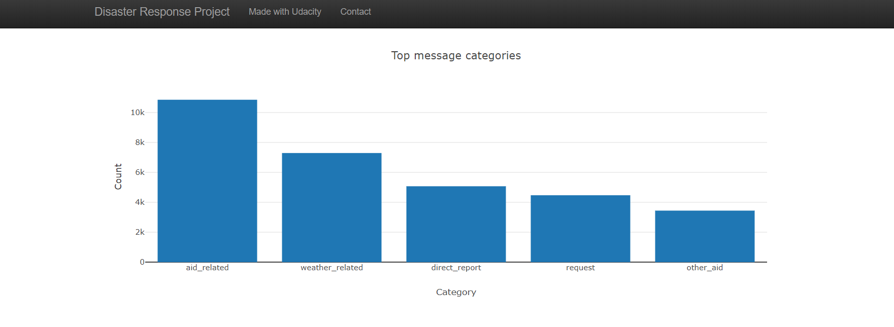
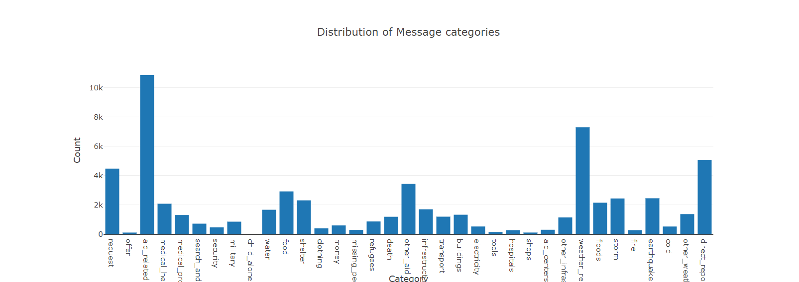
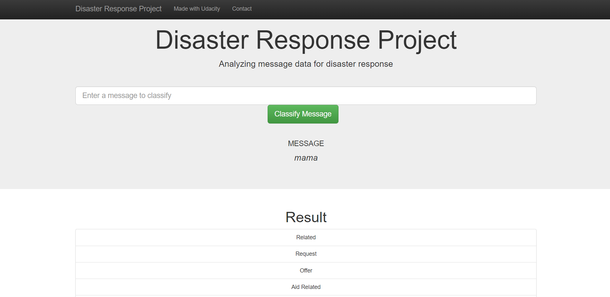
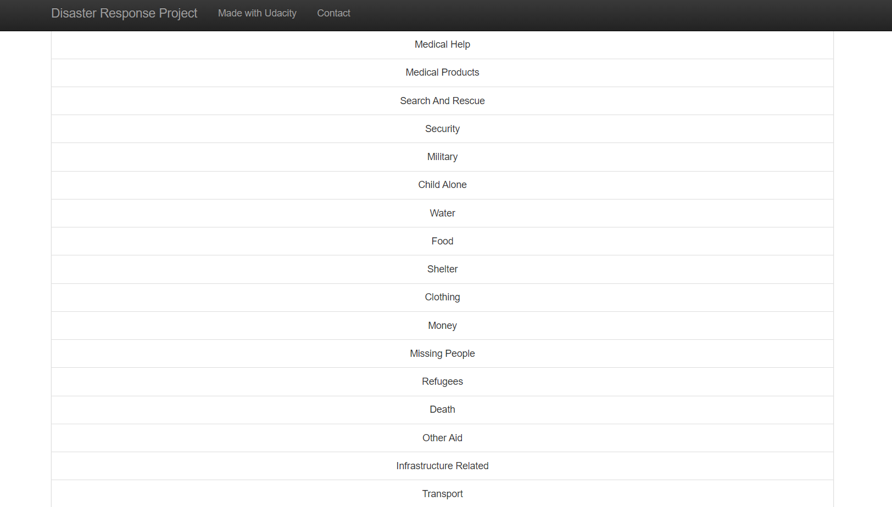
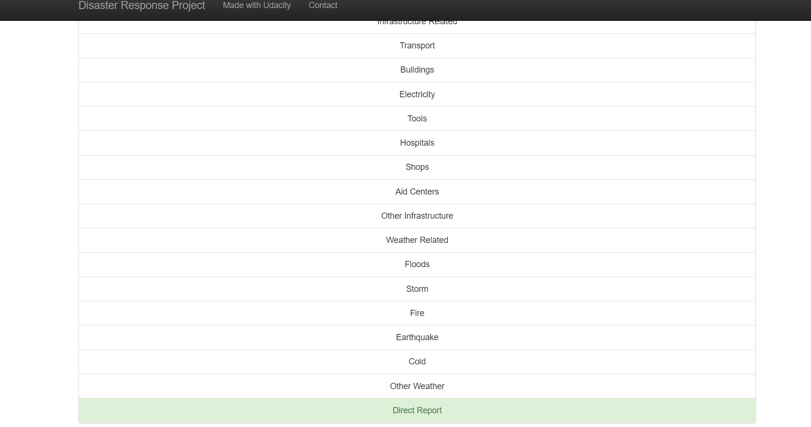

# Disaster Response Pipeline Project
Part of a Udacity class project on creating a pipeline that classifies disaster response messages.
 
## Motivation
This project derives motivation from the need of quick decision making required at times of emergencies when some disasters happen. Resources are often limited during such times and disaster response units do not have time to separate out unnecassary information messages from necassary ones. With this system in place, time and valuable resources of concerned authorities can be saved and utilized in providing relief to needy people.

## Content
* Data
    * process_data.py: reads in the data, cleans and stores it in a SQL database. Basic usage is python process_data.py MESSAGES_DATA CATEGORIES_DATA NAME_FOR_DATABASE
    * disaster_categories.csv and disaster_messages.csv (dataset)
    * DisasterResponse.db: created database from transformed and cleaned data.
* Models
    * train_classifier.py: includes the code necessary to load data, transform it using natural language processing, run a machine learning model using GridSearchCV and train it. Basic usage is python train_classifier.py DATABASE_DIRECTORY SAVENAME_FOR_MODEL
* App
    * run.py: Flask app and the user interface used to predict results and display them.
    * templates: folder containing the html templates

## Example

python process_data.py disaster_messages.csv disaster_categories.csv DisasterResponse.db

python train_classifier.py ../data/DisasterResponse.db classifier.pkl

python run.py

## Aknowledgements
* [Udacity](https://www.udacity.com/) for providing an amazing Data Science Nanodegree Program
* [Figure Eight](https://www.figure-eight.com/) for providing the relevant dataset to train the model

## Screenshots

## Results
Here we show screenshots of results of app after adding a message "mama".

